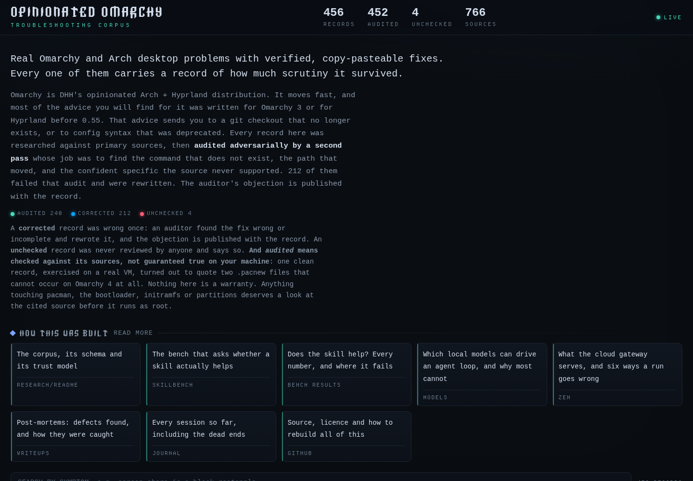

# Opinionated Omarchy

**The agent skill that will fix every problem you have ever had with Omarchy Linux.
Also the ones you have not had yet. Also some that are not about Omarchy.**

Release date: soon. It has been soon since August.

[](https://techluddite.github.io/opinionated-omarchy/)

## What ships today

The skill is vaporware. Everything around it is real, and honestly the surrounding parts
have been doing all the work:

- **A troubleshooting corpus.** 492 real Omarchy and Arch desktop problems with verified,
  copy-pasteable fixes, drawn from 1,361 sources, searchable by symptom. Every record says how
  much scrutiny it survived: 141 passed an adversarial audit clean and 351 had their fix,
  cause or danger rewritten by the auditor. Browse it at
  <https://techluddite.github.io/opinionated-omarchy/> or search it from a clone:

  ```sh
  cd research && python3 tools/build_db.py
  python3 tools/ask.py "zoom screen share is a black rectangle"
  ```

- **A skill bench.** A container that measures whether a skill actually helps a model, with
  18 bench specs, 6 of them general-Linux controls, and two lanes: one grades what a model
  says, the other runs an agent on a real Omarchy VM and grades the machine afterwards.
  Every published figure recomputes from the tracked export in
  [skillbench/results/](skillbench/results/).

- **Numbers, with their caveats attached.** The upstream Omarchy skill lifts Omarchy tasks by
  22.6 to 28.8 points on four cloud models while the controls stay flat, and does nothing at
  all on the agentic lane at full statistical power. Both results are on the
  [results page](https://techluddite.github.io/opinionated-omarchy/results.html), including
  the runs that had to be withdrawn.

## What the skill will do, once it exists

Roadmap, provisional, subject to the skill being written:

- Resolve every `.pacnew` correctly, keeping both your local setting and the upstream one.
- Stop you editing `/usr/share/omarchy`, which Omarchy 3 advice keeps sending you to.
- Convert your `hyprland.conf` to Lua before Hyprland notices you still have one.
- Explain to your manager why the migration is late, in a way that keeps the relationship.
- Train your cat to use the toilet. Dogs in a later release. Flushing is a stretch goal.
- Recover the partition you overwrote in 2019, and the relationship it cost you.
- Get the black rectangle in your screen share to show the slide, and make the slide good.
- Answer, once and for all, whether you should add Redis to that system. (No.)

The corpus can already do the first three and the seventh. The rest are pending the skill,
and the skill is pending. See how that works?

## Why it is vaporware, in one paragraph

The corpus turned out to be the hard part, and it is still not big enough or audited
deeply enough to be the thing a skill is built on. The bench turned out to be the second
hard part, and it has spent most of its life catching its own bugs, four of which imitated a
model failing. Both of those are written up, in public, with the dead ends left in. The
skill gets written when the thing it retrieves from deserves it. The design is settled and
sits in [opinionated-omarchy/CLAUDE.md](opinionated-omarchy/CLAUDE.md), which is the most
documented empty directory on GitHub.

## Reading order

| What | Where |
| --- | --- |
| The corpus, its schema and its trust model | [research/README.md](research/README.md) |
| The bench and its limits | [skillbench/README.md](skillbench/README.md) |
| Every measured figure, and where it fails | [skillbench/RESULTS.md](skillbench/RESULTS.md) |
| Which local models can drive an agent loop | [skillbench/MODELS.md](skillbench/MODELS.md) |
| The cloud gateway, and how a run silently corrupts | [skillbench/ZEN.md](skillbench/ZEN.md) |
| Post-mortems | [writeups/](writeups/) |
| Every session, including the dead ends | [JOURNAL.md](JOURNAL.md) |
| Orientation for an agent picking this up | [CLAUDE.md](CLAUDE.md) |

## Licence

MIT, © 2026 TechLuddite. The two vendored upstream skills, [omarchy/](omarchy/) and
[diagnose-crash/](diagnose-crash/), are MIT © David Heinemeier Hansson and redistributed
unmodified. The site's typefaces carry their own licences. All of it is in
[NOTICE](NOTICE).

The corpus is research, not a warranty. Anything touching pacman, the bootloader, initramfs
or partitions deserves a look at the cited source before it runs as root. The skill, when it
arrives, will of course handle that for you.
